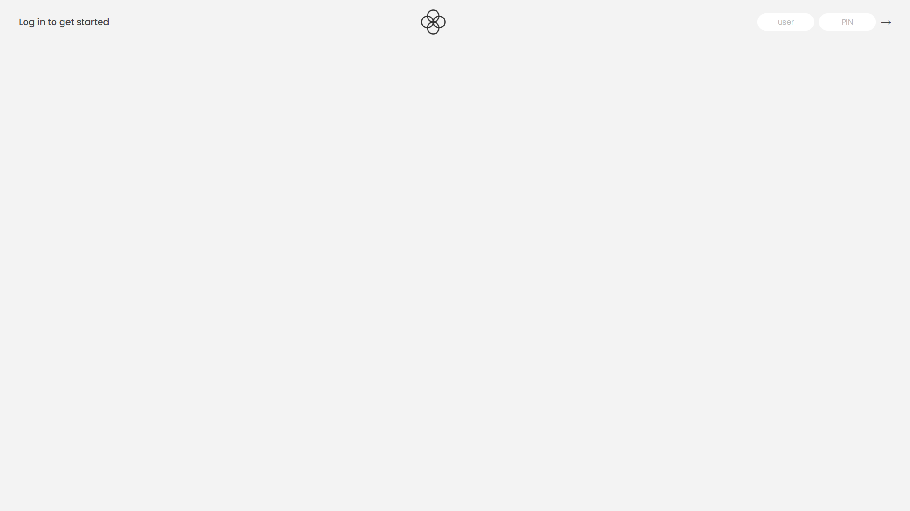
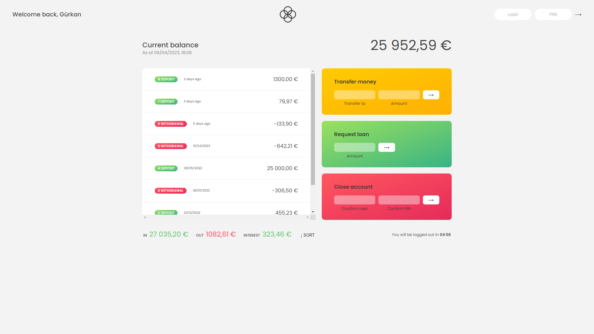

# Bankist App

Bankist App is a project example inspired by Jonas Schmedtmann's [Udemy](https://www.udemy.com/) course. This project simulates simple banking operations such as tracking account balances, making money transfers, and viewing transaction history using a modern web browser.

## Features

- User login: Users can log in with a username and password.
- Account balance: Users can view their account balances.
- Money transfer: Users can transfer money to another user.
- Transaction history: Users can view transaction history on their accounts.

## Installation

To run the project locally, you can follow these steps:

1. Download the project to your computer using either the GitHub repository or as a ZIP file.
2. Open the `index.html` file in a web browser from the project directory to run the project.

## Usage

Once the project is running, users can log in on the main page. Demo username and password are as follows:

- Username: `gy`
- Password: `1111`

After logging in, users can view their account balances, make money transfers, and review transaction history.

## Contributing

If you would like to contribute to the project, please follow these steps:

1. Fork the project (using the "Fork" button in the top right corner).
2. Make changes in your forked project.
3. Apply changes to your forked project by committing and pushing.
4. Submit a pull request to the original project to propose your changes.

## Live Demo

You can try out the live version of the Bankist App [here](https://sparkly-yeot-63648e.netlify.app/).

## Screenshots

## License

Bankist App is licensed under the [MIT License](LICENSE).

## Contact

If you have any questions, suggestions, or feedback regarding the project, please contact me at [gurkanyigitgr@gmail.com].

## Acknowledgements

- Thanks to Jonas Schmedtmann and the [Udemy](https://www.udemy.com/) team for this great course.
